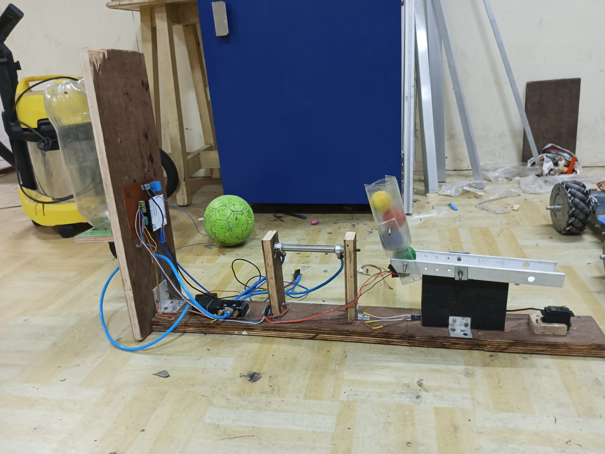

# 🎨 Color Sorting System Using Pneumatics

An Arduino-based color sorting project that identifies object colors using an RGB sensor and sorts them using a pneumatic piston mechanism. This compact and functional system combines mechanical design, sensor integration, and control logic for automation tasks.

---

## 🧠 Overview

This project was built as a collaborative effort to demonstrate real-time color detection and sorting using:

- **RGB Color Sensor**: Detects the intensity of Red, Green, and Blue.
- **Pneumatic Actuation**: Powered by a Directional Control Valve (DCV) to move objects.
- **Servo Motor & Arduino Uno**: Drives precise sorting decisions and motion.

---

## 🔩 Hardware Components

| Component            | Function                               |
|----------------------|----------------------------------------|
| Arduino Uno          | Central controller                     |
| TCS3200 Color Sensor | Measures RGB values of each ball       |
| Servo Motor          | Triggers pneumatic direction control   |
| DCV (Valve)          | Controls compressed air for sorting    |
| Air Tank + Pipes     | Provides pneumatic actuation           |
| Wooden/Aluminum Frame| Physical structure and ball chute      |

---

## ⚙️ How It Works

1. **A colored ball** is dropped into the sensor chamber.
2. The **RGB sensor** reads color intensities.
3. Based on the result, a signal is sent to the servo or valve.
4. The **pneumatic actuator** sorts the ball into the appropriate bin.

---

## 🧑‍🤝‍🧑 Contributors

- **Devyansh Tomar**  
  - Mechanical setup and fabrication  
  - Sensor integration (TCS3200)  
  - Pneumatic DCV control and testing  
  - Wiring and electronics interfacing  
  - 📷 *See setup image below*

- **Vinayak Soni**  
  - Arduino programming and logic design  
  - Color intensity reading algorithm  
  - Timing control and motor actuation code  

---

## 🖼️ Mechanical Setup (Built by Devyansh)

---

## 📌 Notes

- Built and tested as part of Team Robocon (SRMIST) prototype  
- Fully functional with pneumatic actuation  
- Expandable for multi-sensor or conveyor integration

---

## ⭐ Project Status

✔ Working prototype tested  

